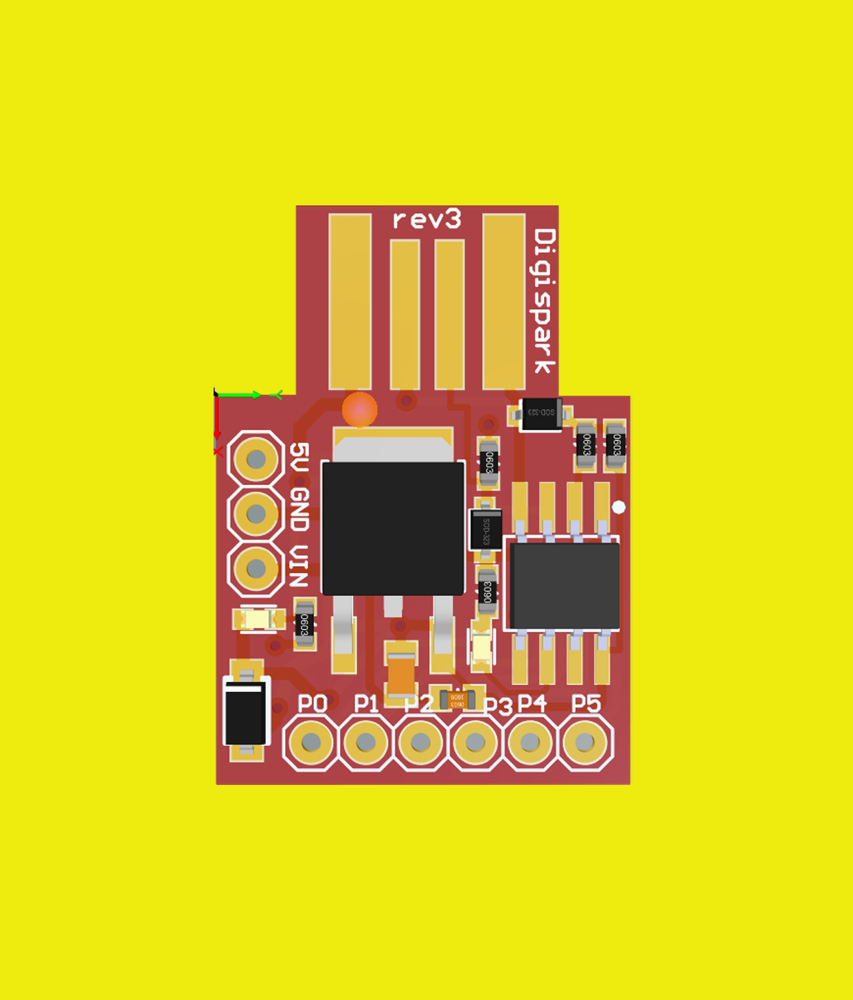
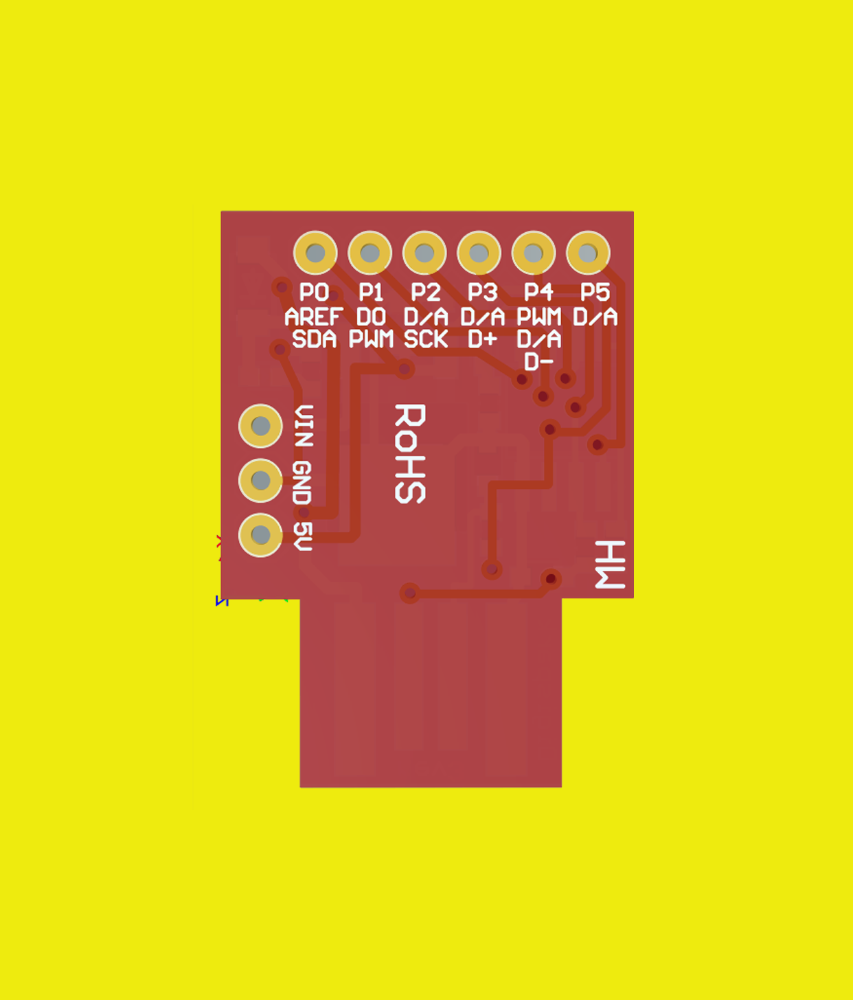
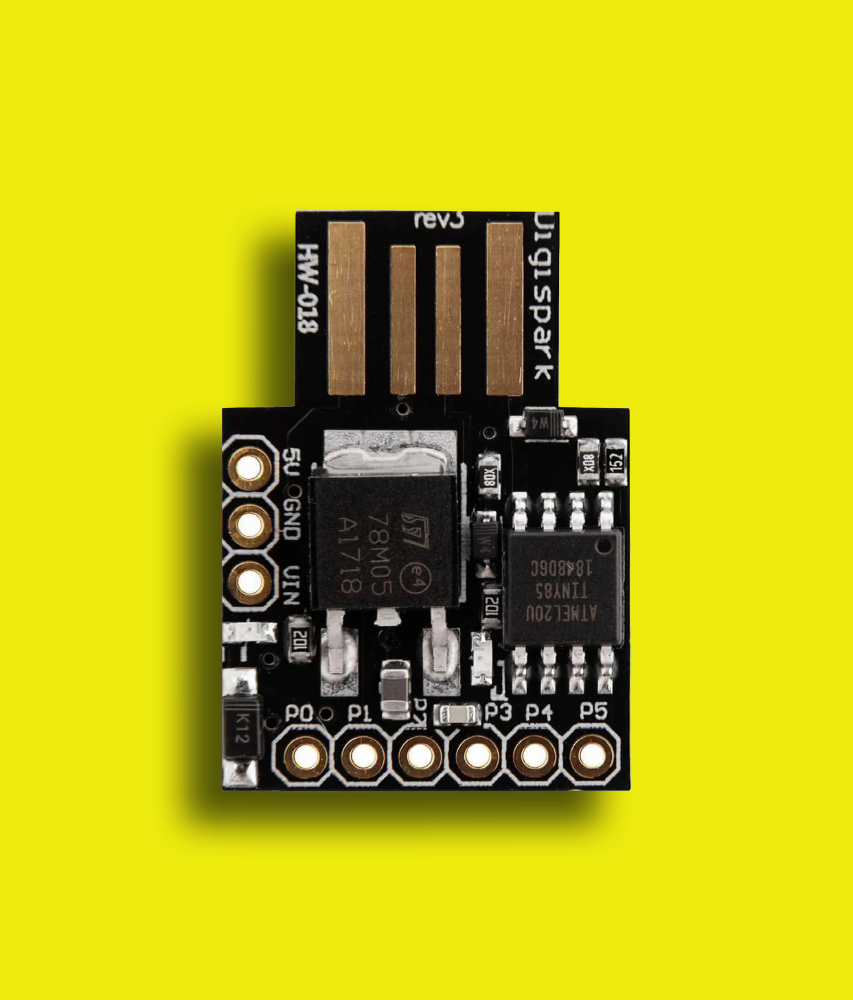
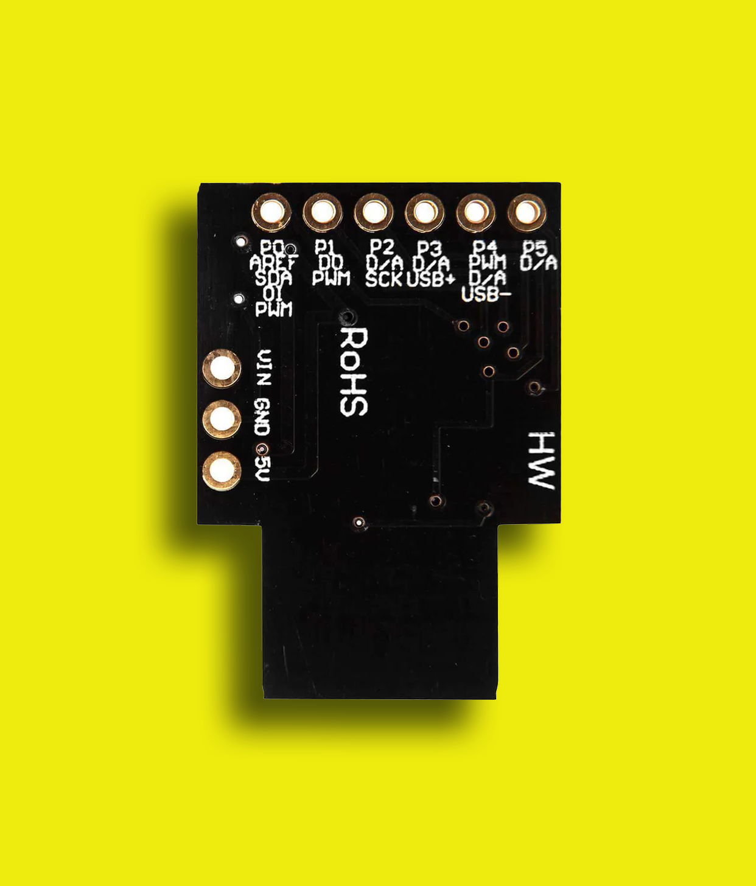

# Digispark-ATTINY85
 
 
 

If you like **Digispark-ATTINY85** - give it a star, or fork it and contribute!  
  

This repository contains the open-source schematic and PCB design files for a **Digispark ATTINY85** development board clone, created using Altium Designer. This board allows you to work with the ATTINY85 microcontroller using the Digispark platform.

💼 As a freelancer, you can also find me on:

 

## Need Help with Embedded Systems or Hardware Design?

I offer professional services for embedded systems design and hardware development at competitive rates starting at **$10/hour**. If you're looking for assistance with your next project, feel free to contact me:

## Schematic Diagram

## PCB Files

## Features
🟣 USB 5 V power supply  
🔵 Full-speed USB interface  
🟢 Bootloader for uploading sketches via USB  
🟡 Onboard 500 mA 5 V regulator  
🟠 6 I/O pins (3 PWM pins, 4 ADC pins)  
🔴 SPI and I2C supported  
🟣 8 KB of flash memory (6 KB usable after bootloader)  
🔵 512 bytes of SRAM  
🟢 512 bytes of EEPROM  
🟡 Compatible with the Arduino IDE using the Digispark board package  
🟠 Operating voltage: 5 V  
🔴 Small form factor with low power consumption  
🟣 Status LED onboard  

## Requirements

- Altium Designer (or a compatible viewer)

## Screenshots :eyes:

<table>
  <tr>
    <th>
        
    </th>
    <th>
        
    </th>  
    <th>
        
    </th>
    <th>
        
    </th>
  </tr>
</table>

## Getting Started

1. **Download the repository**: Click "Clone or download" on the green button above.
2. **Open the project**: Use Altium Designer to open the `.PrjPCB` file located in the main directory.
3. **Review the schematics**: The `schematic.SchDoc` file shows the electrical connections and components used in the design.
4. **Examine the PCB layout**: The `PCB.PCBDoc` file represents the physical layout of the components on the printed circuit board.
5. **Generate BOM (optional)**: Use Altium Designer's BOM generation features to create a list of required components.

## Additional Information

- Firmware: This repository does not include the firmware. You can program the board using the Arduino IDE by installing the Digispark ATTINY85 board package from the boards manager.
- Assembly instructions (optional): Consider adding a separate document or webpage with detailed instructions on soldering and assembling the PCB (if applicable).
- License: Specify the open-source license used for the design files (e.g., MIT License).

## Contributing

We encourage contributions to this project! Feel free to submit pull requests with improvements, bug fixes, or additional features.
